# Password-Manager
As a user you are concerned about the security of your online accounts.
You want a Password Manager program !!
So that you can keep track, securely store and manage all your passwords.
If you have internet access you can access your passwords.

## Important Security warning
This open source version of Password-Manager is suitable for **testing** and **educational** purposes only.

This is a demonstration program where fictional accounts and assioate passwords,
are stored in this case on the google cloud.

It's essential to understand you **NEVER** store passwords into the cloud!! Because,
basically put yourself in a very unconformable position to expose of your privacy.

# User Experience
## User stories

### Site Goals
* To access and manage all your accounts & password over the internet via SSH terminal as a End-To-End Encryption
to your by passing your Firewall to your local domain on a Server that function as a Password-Manager. (for example a Raspberry Pi)
### Features
* To be able to update, create or delete account and password enteries.
* To lists passwords and give a choice to user obscure them from view or show the password explicitly by request.
* To be able to set a Cipher-Key, this is a handy feature to add a extra level of complexity to obsucre your passwords.
* To set up a default user login, makes the UX more user friendly
* To always be able to change the 'master password' to access the password-manager.
* **note** There was a **copy/paste** password clipboard feature available that I need to removed because it was not possible to integrate that
in Heroku cloud environment.
## UX
### Step-By-Step Guide
1. The live DEMO version of Password-Manager is online running on Heroku, [Here](https://terminal-password-manager-2fad20bf8063.herokuapp.com/) the repo is located [here](https://github.com/Harmonica-Men/Password-Manager)
2. RUN PROGRAM
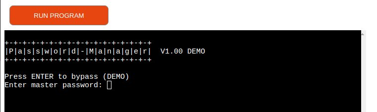
    * Enter a valid password to access the program (you can always be changed afterwards)
    * Press Enter to bypass (DEMO version)

3. Welcome to Password-Manager
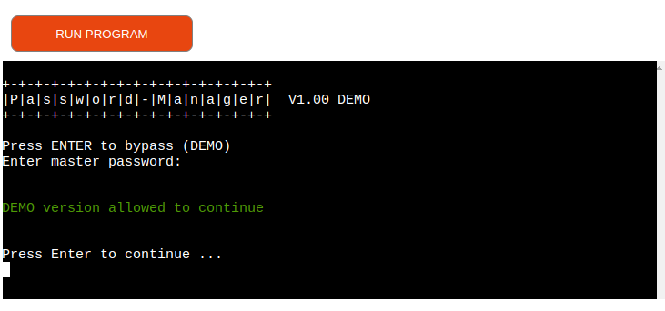

4. Main Menu
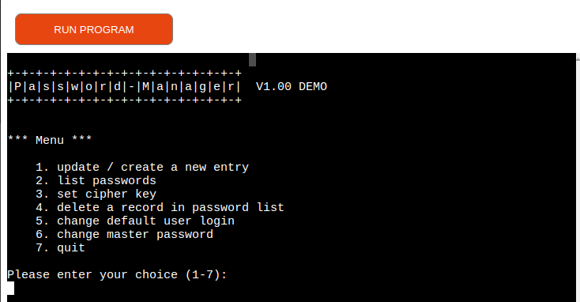
Menu option 1 - Update / create a new entry
    * Two choices:
        1. Press Enter to return to main menu
        2. Enter new site or platfrom
    * Enter a new site: CodeInstitute (example)
    * Enter login credentials, again two choices
        1. Press Enter for the default login
        2. Enter your credentials
    * Enter password, again two choices
        1. Press Enter to auto-generated new random password
        2. Enter your own password
    * Password added successfully
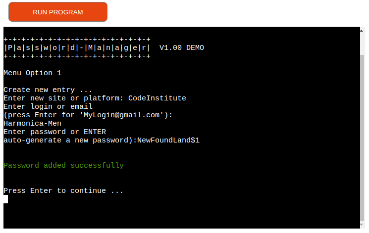

5. Menu Option 2 - List passwords
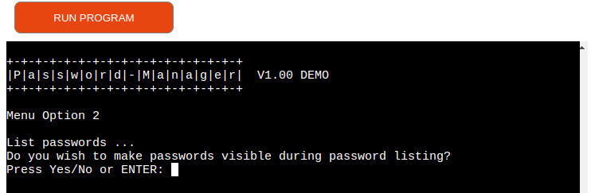
    * Two choices whether or not you wish the password to be visible during the listing?
    1. user choice is : No or Enter
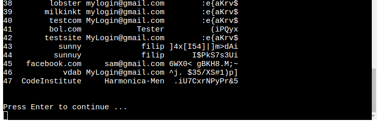
all accounts and passwords entries are shown whit ciphered passwords.
    2. user choice is : Yes
    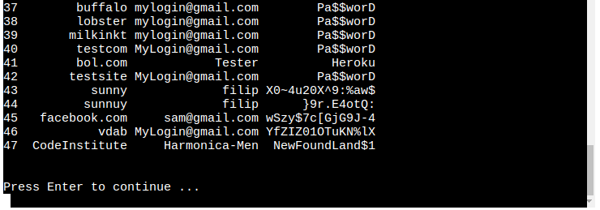
all accounts and passwords entries are now chown whit there true context. (de-ciphered password)

6. Menu Option 3 - Change Cipher key
    * This allow the user to change how password are encrypted into the google spreadsheet. The main advantage is to add a extra level of complexity how your password are stored or displayed.
    * inorder to ativie this a 'Caeser cipher' is used as basic principle.
    by shifting the alphabet in a number of letters left or right, the password can be obsured. However instead of using a decimal places to shift in this program a cipher key is used. This methode is also know as the 'Vigenere Cipher'.
    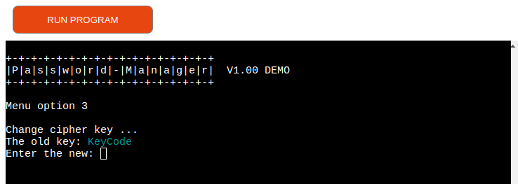
    * **note** when Enter a blank cipher key the user, the cipher key is not changed and the user return back to the Main Menu

7. Menu Option 4 - delete a record in password manager list.
    * This allow the user to delete a record from the password list
    * By enter a record index number the record is deleted.
    * when entered a blank index number the user goes back to the Main Menu
    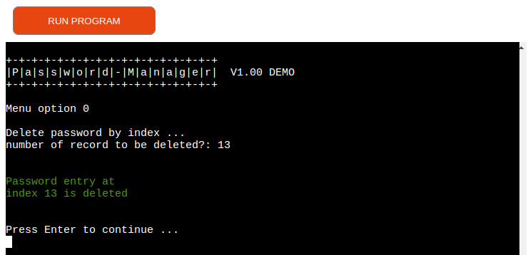

8. Menu Option 5 - change default user login
    * This give the possiblity to enter a pre-determent user into password manager when a new account - password entry gona been entered.
    * Here also two choices, enter a new user login or
    * when the user leaves the login input field empty the user returns back to Main Menu.
    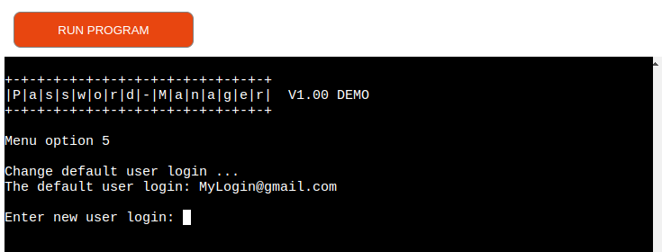

9. Menu Option 6 - Change The Master Password
    * Every door has a key and in this case as extra level protection, there is a master password to remember, this is in fact the only password to be remembered.
    * Here are also two choices, enter a new master password or
    * Leave the master password entry empty to go back to the main menu.
    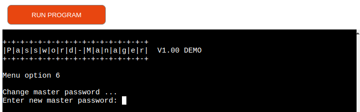
    * Do not forget your using the DEMO version of password manager allowing you to bypass the master password confirmation on startup. But the master password is actually changed

10. Menu Option 7 - Quit
    * This option is to quit the Password-Manager
    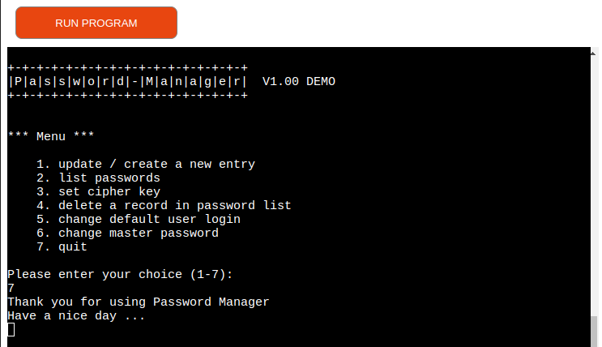

### Deployment
* As already been said it is not so practical to use google sheet from the cloud to store your passwords.
* Therefore a small alteration to the source code can be made to store this password data file locally.
* Because everything is done in a terminal mode you can use any platform to access the password-manager.
* The source-code of 'run.py' can be compiled in python and executed from the command line.
* A data-file is stored on the local device can be in a JSON format.

**note** this data is unencryted and have no hashes of validation to it.

Validation  -  linter - sceen shoit

## Disclaimer
This application has not been fully tested, so there may be still problems due to the new build script or to the new repository structure. So, for the moment, use it at your own risk!