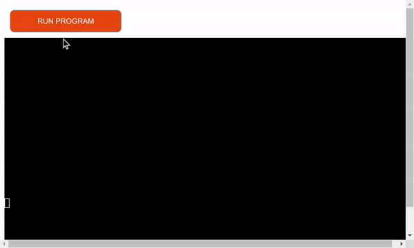

## Index - Table of Contents

- [Password Manager](#password-manager)
- [Important Security Warning](#important-security-warning)

- [UX](#ux)

  - [Site Goals](#site-goals)
  - [User Stories](#user-stories)

- [A Step By Step Guide](#a-step-by-step-guide)

  - [Step 1 DEMO version](#step-1-demo)
  - [Step 2 RUN PROGRAM](#step-2-run-program)
  - [Step 3 Enter Master Password](#Step-3-Enter-Master-Password)
  - [Step 4 Main Options](#Step-4-Main-Options)
    - [Menu Option 1](#Menu-option-1)
      Update / Create a new entry
    - [Menu Option 2](#Menu-Option-2)
      List passwords
    - [Menu Option 3](#Menu-Option-3)
      Set Cipher Key
    - [Menu Option 4](#Menu-Option-4)
      Delete a record in password list
    - [Menu Option 5](#Menu-Option-5)
      Change user default password
    - [Menu Option 6](#Menu-Option-6)
      Change master password
    - [Menu Option 7](#Menu-Option-7)
      Quit (Step 5)

- [Technology Used](#technologies)

- [Testing](#testing)

  - [Validator Testing](#validator-testing)
  - [Manual Testing](#manual-testing)
  - [Fixed Bugs](#fixed-bugs)

- [Deployment](#deployment)

- [Credits](#credits)

- [ Acknowledgements](#acknowledgements)

##

# Password-Manager

As a user you are concerned about the security of your online accounts.
You want a Password Manager program!!
So that you can keep track, securely store and manage all your passwords.
If you have internet access you can access your passwords.

## Important Security Warning

This open source version of Password-Manager is suitable for **testing** and **educational** purposes only.

This is a demonstration program where fictional accounts and associate passwords,
are stored in this case on the google cloud.

It's essential to understand you **NEVER** store passwords into the cloud!! Because,
basically put yourself in a very uncomfortable position to expose of your privacy. Because the cloud is **NOT** your intellectual property.

# UX

## Site Goals

To access and manage all your accounts & password over the internet via SSH terminal as a End-To-End encryption
to your by passing your firewall to your local domain on a Server that function as a Password-Manager. (for example a Raspberry Pi or a Domain Controller)

## User Stories

As a user I want:

- To be able to update, create or delete account and password enteries.
- To lists passwords and give a choice to the user obscure them from view or show the password explicitly by request.
- To be able to set a Cipher-Key, this is a handy feature to add a extra level of complexity to obsucre your passwords.
- To set up a default user login, makes the UX more user friendly.
- To always be able to change the 'master password' to access the password-manager.
- **note** There was a **copy/paste** password clipboard feature available but that I need to removed because it was not possible to integrate that
  in Heroku cloud environment.

As the administrator I want:

- Access the file that's stored the content of the accounts and passwords.
- The passwords itself are encrypted.

# A Step By Step Guide

## Step 1 Demo

The live DEMO version of Password-Manager is online running on Heroku, [here](https://terminal-password-manager-2fad20bf8063.herokuapp.com/) the repo is located [here](https://github.com/Harmonica-Men/Password-Manager)

## Step 2 RUN PROGRAM

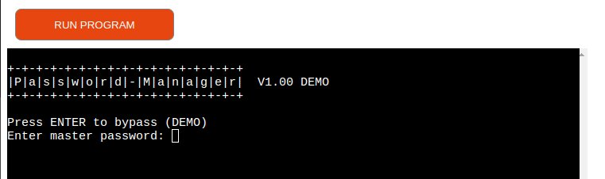

* Enter a valid password to access the program (you can always be changed afterwards)  
* Press Enter to bypass (DEMO version)

## Step 3 Enter Master Password

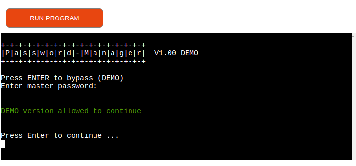

## Step 4 Main Options

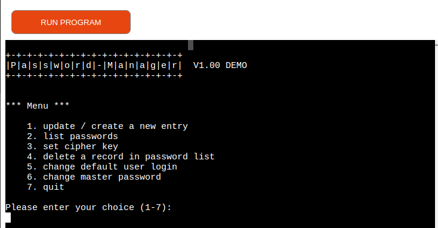

### Menu option 1

**Update / Create a New Entry**

- Two choices:
  1. Press Enter to return to main menu
  2. Enter new site or platforms
- Enter a new site: CodeInstitute (example)
- Enter login credentials, again two choices
  1. Press Enter for the default login
  2. Enter your credentials
- Enter password, again two choices
  1. Press Enter to auto-generated new random password
  2. Enter your own password
- Password added successfully

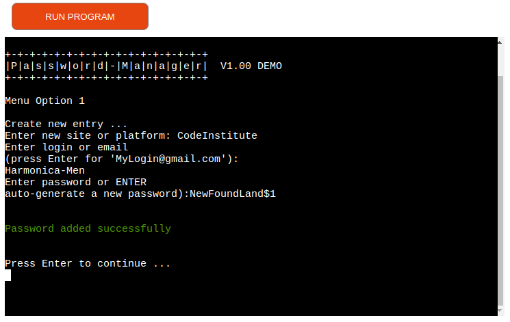

### Menu Option 2

**List passwords**

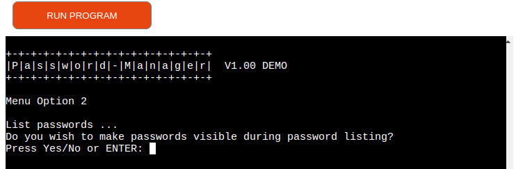

- Two choices whether or not you wish the password to be visible during the listing?

      1. user choice is : No or Enter
      
  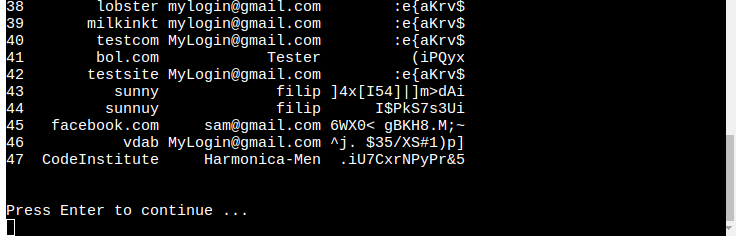

- all accounts and passwords entries are chown whit encrypted passwords.

      2. user choice is : Yes

  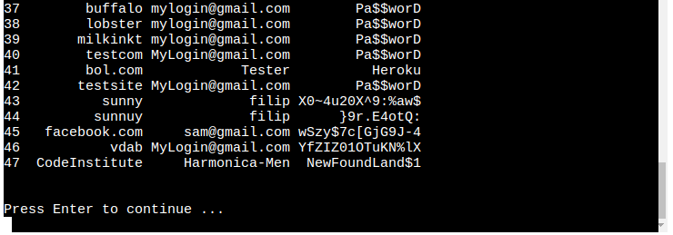

  all accounts and passwords entries are now chown whit there true context. (de-ciphered password)

### Menu Option 3

**Change Cipher Key**

- This allow the user to change how password are encrypted into the google spreadsheet. The main advantage is to add a extra level of complexity how your password are stored or displayed.
- In order to achieve this a 'Caeser cipher' is used as basic principle,
  by shifting the alphabet in a number of letters left or right, the password can be obscured. However instead of using a decimal places to shift in this program a cipher key is used. This method is also know as the 'Vigenère cipher'.
  For additional information about the Vigenère cipher check this link: [here](https://https://en.wikipedia.org/wiki/Vigen%C3%A8re_cipher/)

    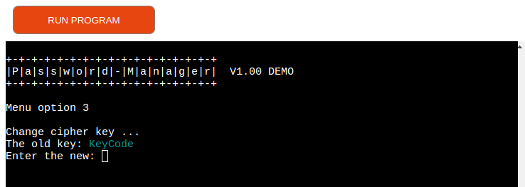

- **note** When Enter a blank cipher key, the key is not changed and the user return back to the Main Menu.

### Menu Option 4

**Delete a Record In Password Manager List**

- This allow the user to delete a record from the password list.
- By enter a record index number the record is deleted.
- When Enter a blank index number the user goes back to the Main Menu.
  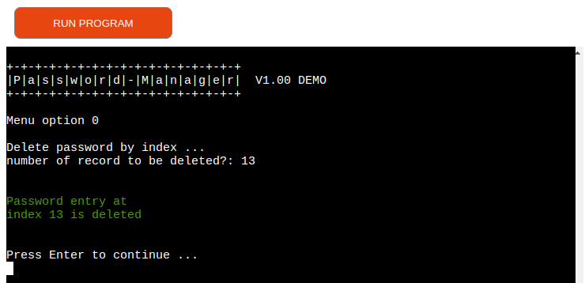

### Menu Option 5

**Change Default User Login**

- This give the possibility to enter a pre-determent user into password manager when a new account, password entry gonna been entered.
- Here also two choices, enter a new user login or

  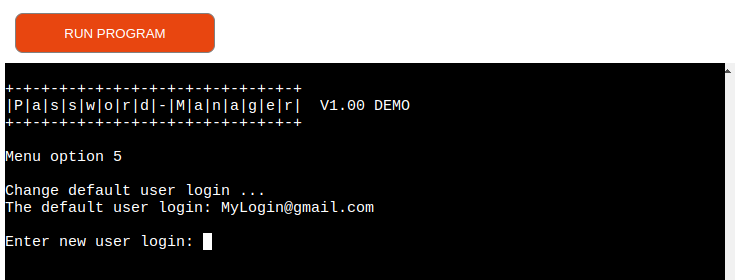

- When the user leaves the login input field empty the user returns back to Main Menu.
  

### Menu Option 6

**Change The Master Password**

- Every **$door$** has a key and in this case a extra level protection is been added, there is a master password to remember to access the main program, this is in fact the only password to be remembered.
- Here are also two choices, enter a new master password or
  
- Leave the master password entry empty to go back to the Main Menu.
- Do not forget your using the DEMO version of password manager allowing you to bypass the master password confirmation on startup. But the master password is actually changed and stored into the spreadsheet.

### Menu Option 7

**Quit**

- This option is to quit the Password-Manager
  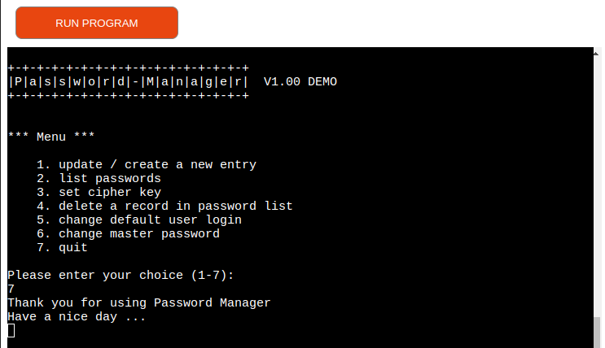

## Technologies

- Heroku
  - Used to deploy and host the application
- Python
  - Code used to create the application
- Visual Code
  - Visual Studio Code (VS Code) was developed by Microsoft. It is a free, open-source code editor designed for writing and editing code in various programming languages.
    VS Code is available for Windows, macOS, and Linux and is actively maintained by a team of developers at Microsoft.
- GitHub
  - Source code is hosted on GitHub and deployed using Heroku.
- Git
  - Used for version control
- Screen Recorder
  - Capture game play for title gif
  - https://chrome.google.com/webstore/detail/screen-recorder/hniebljpgcogalllopnjokppmgbhaden
- ezgif
  - Used to create the title gif (https://ezgif.com/)

**Python Packages**

- Colorama
  - Adding colored terminal text to the game (https://pypi.org/project/colorama/)
- Random
  - Used to pick random cards from the deck
- OS
  - Used to clear terminal after option selection, each completed hand and end of the game.
- String
  - the string module for working with string constants
- Pandas
  - the pandas library for data manipulation
- gspread
  - the gspread library for Google Sheets integration

## Testing

### Validator Testing

- CI Python Linter ([PEP CI Validator](https://pep8ci.herokuapp.com/))

  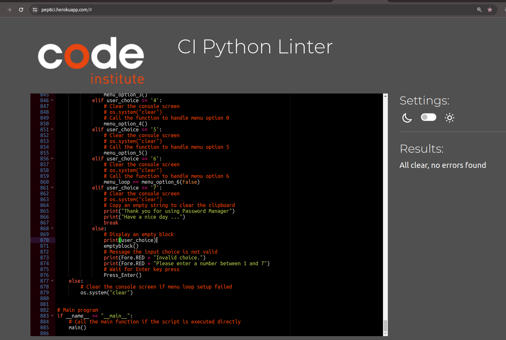

### Manual Testing

| Test                                                                                       | Steps                                                 | Expected                                                                                                                                                                  | Actual |
| ------------------------------------------------------------------------------------------ | ----------------------------------------------------- | ------------------------------------------------------------------------------------------------------------------------------------------------------------------------- | ------ |
| On run program enter the master password                                                   | 'Press Enter' to bypass (only demo version)             | A demo confirmation message appears and acknowledge by pressing Enter                                                                                                     | pass   |
| On run program enter password less then 4 characters                                        | Enter password of less then 4 characters                   | Error message appear less 4 characters input and exit the program                                                                                                                  | pass   |
| On run program enter password greater then 20 characters                                    | Enter password of greater then 20 characters               | Error message appear greater 20 characters input and exit the program                                                                                                                 | pass   |
| Master password entry, known password                                                  | Enter a valid master password                         | The main option menu appears                                                                                                                                              | pass   |
| Master password entry, unknown password                                                    | Enter a invalid master password                       | A error message appears that the input of the Master password was incorrect then programs stops                                                                           | pass   |
| Site creation entry, less 4 characters                                                        | Enter a input of less of 4 characters                       | A error message appears that the input of the Site or Platform was incorrect and continues whit the default                                                               | pass   |
| Site creation entry, greater 18 characters                                                    | Enter a input of greater of 18 characters                   | A error message appears that the input of the Site or Platform was incorrect and continues whit the default                                                               | pass   |
| Site creation entry, between 4 and 18 characters                                              | Enter a valid site                               | Continues to login credentials input field                                                                                                                                | pass   |
| Main Menu option choice when exceeds between 1 and 7 or letters are given                  | Enter a invalid Menu option choice                    | A error message appears that a invalid choice is given, 'Press Enter' to redirect back to main Menu                                                                              | pass   |
| In main menu when menu option is followed by enter                                         | 'Press Enter'                                           | A error message appears that a invalid choice is given, 'Press Enter' to redirect to main Menu                                                                              | pass   |
| Choose Main Menu option 1. Update / create a new entry                                     | Enter number 1 as menu option                         | Menu option 1 appears                                                                                                                                                     | pass   |
| In menu option 1 enter a empty input                                                       | 'Press Enter' in menu option 1                          | A error message appears and redirect to main menu                                                                                                                         | pass   |
| Create a new non-existent site or platform                                                | The program checks if the site is completely new      | The login option appears                                                                                                                                                  | pass   |
| When a new site is entered, less 4 characters                                          | Enter a input of less of 4 characters                       | A error message appears that informs the user the inputted data is too big and after pressing enter redirected to the main option menu.                                     | pass   |
| When a new site is entered, greater 18 characters                                         | Enter a input of greater of 18 characters                   | A error message appears that informs the user the inputted data is too big and after pressing enter redirected to the main option menu.                                     | pass   |
| When a new site is entered, between 4 and 15 characters                                         | Enter a valid site enter                              | The password entry option appears                                                                                                                                        | pass   |
| Auto-generate password when 'Press Enter'                                                    | 'Press Enter'                                           | A confirmation message appear that password is successfully added to the password list, 'Press Enter' to redirected to main menu                                            | pass   |
| Enter manual new password, less than 6 characters                                              | Enter a input of less of 6 characters                       | A error message appears that informs the user the inputted data is too big and will be auto-generate, after pressing enter redirected to the main option menu              | pass   |
| Enter manual new password, greater than 20 characters                                          | Enter a input of greater of 20 characters                   | A error message appears that informs the user the inputted data is too big and wll be auto-generated, after pressing enter redirected to the main option menu.             | pass   |
| Enter manual new password, between 6 and 20 characters                                         | Enter a valid site                               | The password entry option appears                                                                                                                                        | pass   |
| Choose Main Menu option 2. Lists passwords                                                 | Enter number 2 as menu option                         | Menu option 2 appears                                                                                                                                                     | pass   |
| List passwords when the actual spreadsheet is empty or contain no data                     | Enter something                                       | A error message appears that informs the list is empty, after pressing enter redirected to the main option menu.                                                          | pass   |
| The choice of the password listing are letters                                              | Enter random string that’s neither ‘n’,’N’ or ‘Y’,’y' | Listing of accounts and passwords unencrypted whit index numbers - 'Press Enter' to redirect main menu                                                                      | pass   |
| Choice password listing whether or not make passwords readable during listing, Yes          | Enter Y or Yes in capital                             | Listing of accounts and passwords unencrypted whit index numbers, 'Press Enter' to redirect main menu                                                                      | pass   |
| Choice password listing whether or not make passwords readable during listing, No or enter | Enter N , n or Enter                                 | Listing of accounts and passwords encrypted whit index numbers 'Press Enter' to redirect main menu                                                                          | pass   |
| Choose Main Menu option 3. Set cipher key                                                  | Enter number 3 as menu option 3                       | Enter input field to enter new cipher key                                                                                                                                 | pass   |
| Enter new cipher key, greater than 8 characters                                                 | Enter a input of greater of 8 characters                    | A error message appears that informs the user the inputted data is too big and wll be auto-generated - after pressing enter redirected to the main option menu.             | pass   |
| Enter new cipher key, 'Press Enter'                                                         | Input field 'Press Enter'                               | A error message appears that informs the user the inputted data is empty and old cipher will be still be used after pressing enter redirected to the main option menu.      | pass   |
| Enter new cipher key, between 1 and 8 characters                                                | Enter a valid cipher key                              | A confirmation message appear that password is successfully modified the cipher key and 'Press Enter' to redirected to main menu                                            | pass   |
| Choose Main Menu option 4. delete a record in password list                                | Input field 'Press Enter'                               | A error message appears that informs the user the inputted empty index number to be delete and redirected to the main option menu.                                              | pass   |
| To be deleted index number is 0                                                          | Input field is zero                                   | A error message appears that informs the user the inputted index is zero and there are no records kept there, nothing is deleted and redirects to main menu                | pass   |
| To be deleted index number exceeds the maximum numbers of records                          | Input number higher of maximum numbers of records     | A error message appears that informs the user the inputted index exceeds the maximum number of records nothing is deleted and redirects to main menu                       | pass   |
| To be deleted index input are letters instead of number                                    | Input some random string                              | A error message appears that informs the user the inputted index is invalid and nothing is deleted and redirects to main menu                                              | pass   |
| Choose Main Menu option 5. change default user login                                       | 'Press Enter' in menu option 5                          | Menu option 5 appears                                                                                                                                                     | pass   |
| Enter new default user login                                                               | 'Press Enter' or empty field                            | A error message appears that informs the user the inputted empty field and redirected to the main option menu.                                                              | pass   |
| Enter new default user login, greater then 25 characters                                        | Enter a input of greater of 25 characters                   | A error message appears that the input of the default user exceed the max of 25 characters was incorrect and continues whit the default user login to be redirected to main menu | pass   |
| Enter new default user login, less then 25 characters                                           | Enter the input field less then 25 characters               | A confirmation message appear that the default user is successfully added, 'Press Enter' to redirected to main menu                                                        | pass   |
| Choose Main Menu option 6. Change the master password                                      | 'Press Enter' in menu option 6                          | Menu option 6 appears                                                                                                                                                     | pass   |
| Enter new master password                                                                  | 'Press Enter' or empty field                            | Because this is a demo version when 'Press Enter' a confirmation appears to acknowledgement to bypass the password is granted                                              | pass   |
| Enter new master password less of 3 characters                                                   | Enter password of less then 3 characters                   | Error message appear lesser then 3 characters inputted and 'Press Enter' for redirect to main menu                                                                                              | pass   |
| Enter new master password greater of 20 characters                                               | Enter master password greater then 20 characters           | Error message appear greater then 20 characters input and 'Press Enter' for redirect to main menu                                                                                             | pass   |
| Enter new master password, between 3 and 20 characters                                          | Enter a valid master password                         | A confirmation message appear that master password is successfully added to the google spreadsheet, 'Press Enter' to redirected to main menu                                | pass   |
| Choose Main Menu option 7. Quit                                                            | Enter number 7 to quit                                | Program stops immediately and presents a goodby message                                                                                                                     | pass   |

### Testing User Stories

|             Expectation (As a user, I want to...)             |                             Result (As a user, I...)                              |
| :-----------------------------------------------------------: | :-------------------------------------------------------------------------------: |
| Get a quick and thorough overview of the accounts & password  |         Can find my way around the app easily and quickly I one overview          |
| Every step in app there is a clear description what to expect |        Can read the instructions from the Menu options in a logical manner        |
|      Be able to enter the app simple click interactions       | Run the app by simply clicking the `y` , `n` or  `Enter`' to continue or complete the program and navigate whit numbers in Menu options|
|                  Receive correction messages                  |             When I inputted wrong the program tells me what to do next             |

### Fixed bugs

- Text line length greater 79 characters
- Clear Terminal positioning
- Whitespaces

## Deployment

### Version Control

The site was created using the Visual Code code editor and pushed to github to the remote repository [here](https://github.com/Harmonica-Men/password-Manager) .

The following git commands were used throughout development to push code to the remote repo:

`git add .` - This command was used to add the file(s) to the staging area before they are committed.

`git commit -m “commit message”` - This command was used to commit changes to the local repository queue ready for the final step.

`git push` - This command was used to push all committed code to the remote repository on github.

### Deployment Through Heroku

The below steps were followed to deploy this project to Heroku:

- Go to Heroku and click "New" to create a new app.
- Choose an app name and region, click "Create app".
- Go to "Settings" and navigate to Config Vars. Add the following config variables:
  - PORT : 8000
- Navigate to Buildpacks and add buildpacks for Python and NodeJS (in that order).
- Navigate to "Deploy".
- Set the deployment method to Github and enter repository name and connect.
- Scroll down to Manual Deploy, select "main" branch and click "Deploy Branch".
- The app will now be deployed to heroku

The live link can be found [here](https://terminal-password-manager-2fad20bf8063.herokuapp.com/)

### Clone The Repository Code Locally

Navigate to the GitHub Repository you want to clone to use locally:

- Click on the code drop down button
- Click on HTTPS
- Copy the repository link to the clipboard
- Open your IDE of choice (git must be installed for the next steps)
- Type git clone copied-git-url into the IDE terminal

The project will now of been cloned on your local machine for use.

## Credits

### w3 schools

> Used to reference Python Structure

### Stack Overflow

> Used to reference different syntax issues from existing older boards. Also used to query clear function issues when I ran into them as referenced in the bug section.

## Acknowledgements

### Daisy McGirr

- My Mentor with Code Institute who has provided me with excellent feedback and guidance through this project.

[def]: #step-2-run-the-program