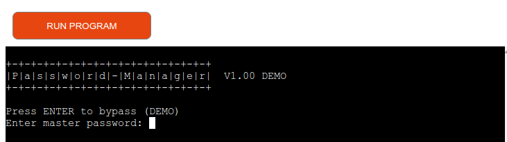

# Password-Manager
As a user concerned about the security of your online accounts,
You want a Password Manager program !!
So that you can keep track, securely store and manage all your passwords.
If you have internet access you can access your passwords.

## Disclamer 

This is a demonstration program where fictional accounts and assioate passwords,
are stored in this case on the google cloud.
It's essential to understand you **NEVER** store passwords into the cloud !! Because,
basically put yourself in a very unconformable position to expose your privacy.

# User Experience 
## User stories

### Site Goals
* To access and manage all your accounts & password over the internet via SSH terminal as a End-To-End Encryption 
to your by passing your Firewall to your local domain on a Server that function as a Password-Manager. (for example a Raspberry Pi)
### Features
* To be able to update, create or delete account and password enteries.
* To lists passwords and give a choice to user obscure them from view or show the password explicitly.
* To be able to set a Cipher-Key, this is a handy feature to add a extra level of complexity to obsucre your passwords. 
* To set up a default user login, makes the UX more user friendly
* To always be able to change the 'master password' to access the password-manager.
* **note** There was a copy/paste password feature avaibele that I removed because it was not possible to integrate that
in Heroku cloud envrirement

